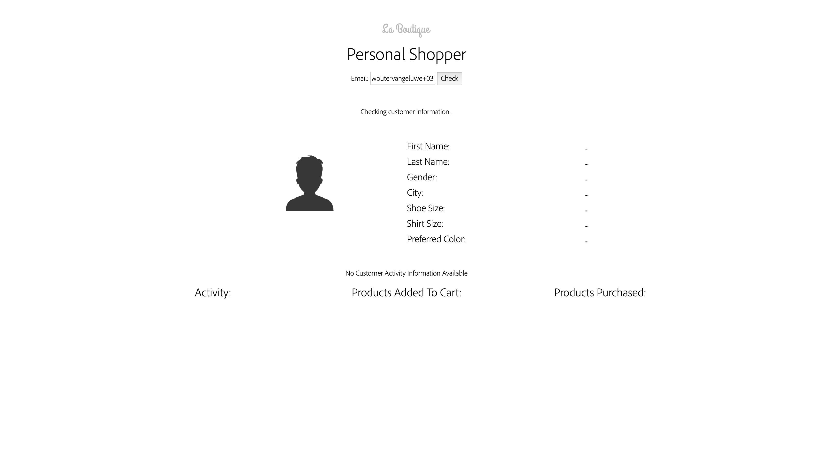
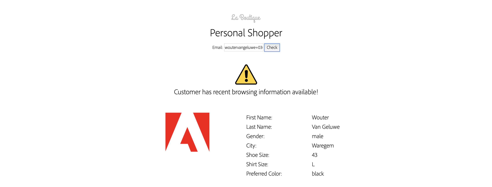

### Exercise 2.4.3 - Personal advice in the brick-and-mortar store

ATTENTION: please remember [the Platform Demo Best Practices guidelines](./ex0.md)

#### **Context:** 

  * As a customer, I expect the same level of personalisation in the offline world just like I do in the online world. 
  * As a brand, I want to be as consistent as possible in my communication with my customers, and as such, I consider my offline channels the same as my online channels.

As a brand, we need to know when the customer walks into an offline, brick-and-mortar store. Having this knowledge is dependant on having the location information fast enough. One of the best ways to capture micro-location information is using beacons. beacons are a very sensitive topic amongst retailers: many retailers have jumped on this technology a number of years ago and have tried using beacons, but most have failed. The biggest hurdle was that when capturing this information from a technical perspective, there simply weren't any systems around that had the scale and capabilities of doing something powerful with that information. Just like it happens a lot with technology: people bought technology for the sake of technology but hadn't really thought a lot about the use-case.

With Platform, we now have the capability to technically support beacons, but also have the capability to use these beacons on a micro-level for personalization in push and email-notifications.

If you want to read up on beacons and see how that technology works, check out [this page](https://estimote.com/).

In this use-case, we're zooming in on using the presence of a customer inside a store, in real-time, to inform the in-store employees that a specific customer with a specific background and preferences has entered the store. The goal is to provide this valuable information in a push-way, onto an employee's back-office screen or onto an employee's smartphone or tablet device.

The beacon detects the entry of the customer in the store and immediately sends the customer's ID and NS onto a server-side infrastructure. The Personal Shopper-dasboard polls that server-side infrastructure every couple of seconds and once an ID and NS are found, displays the customer information on one of the employee-facing screens.

Regarding the use of a customer micro-location: this is clearly an opt-in only story that fully respects **GDPR** and a customer's consent. Some brands that we've spoken to will offer this as an optional service to all their customers, some others will restrict the service to their VIP-customers. Regardless of who will use this service, every customer who does use the service will need to actively opt-in.

From a technical perspective, when you click on the "Check"-button on the dashboard, this Personal Shopper-dashboard does the following:

  * Capture the Email ID
  
  * Join the Email ID with the Namsespace of "email".
  
  * Send this information to an Adobe I/O runtime function
  
  * The Adobe I/O runtime function then does the following:
    * Authenticate to Adobe I/O
    * Send a first call, specifying the Profile XDM Schema, with the Email ID and NS of email to Platform's API's 
    * Send a second call, specifying the Experience Event XDM Schema, with the Email ID and NS of email, to Platform's API's
  * The response from Platform on both calls is sent back to the Personal Shopper-dashboard
  * The Personal Shopper-dashboard parses the information, takes the requested information and displays it on the Personal Shopper-dashboard.

Also remember, the interaction doesn't have to be one-way only. When the customer makes an offline purchase, the Point-Of-Sales terminal should send an Experience Event to Platform so that Platform also receives all transactional data in real-time, to impact all communication on online channels.

Thanks to this bi-directional interaction between a POS environment and Platform, many use-cases become much easier and more powerful:

  * General Suppression: don't target a customer who just bought any product for a specific amount of time
  * Product Specific Suppression: don't target a customer who bought an expensive suit, with messaging around buying a new suit for the next 6 months 
  * Up-sell: a customer who just bought a suit, might need a new tie
  * Look-alike Modeling: find more customers like the customer who bought a new suite
  * ...

FYI: For demo-reasons, we don't apply a push-flow in this demo environment. However you should clearly articulate to your customer that in the ideal use-case, the beacon triggers this flow.

#### **Demo flow:**

  * On your SYTYCD - website, in the menu bar, click on the 3 dots and click ``Personal Shopper``.

  
  
  * The Email Address you used to register on the website will be automatically pre-populated. Click on the ``Check`` - button.
  
  
  
  * After 1-2 seconds, your Unified Profile data is being shown to the store employee, including your browsing behaviour from the last couple of seconds and all of the important information like shoe size, shirt size and preferred color.
  
  

FYI - This Personal Shopper dashboard is created for demo-purposes only, it's not something we sell :-). A brand who wishes to implement this use-case will need to build out such a dashboard themselves. We can off course support the brand in this process, but the brand will be leading this additional development.

[Next Step: Questions? Call the Call Center!](./ex4.md)

[Go Back to Module 2](../README.md)

[Go Back to All Modules](/../../)

